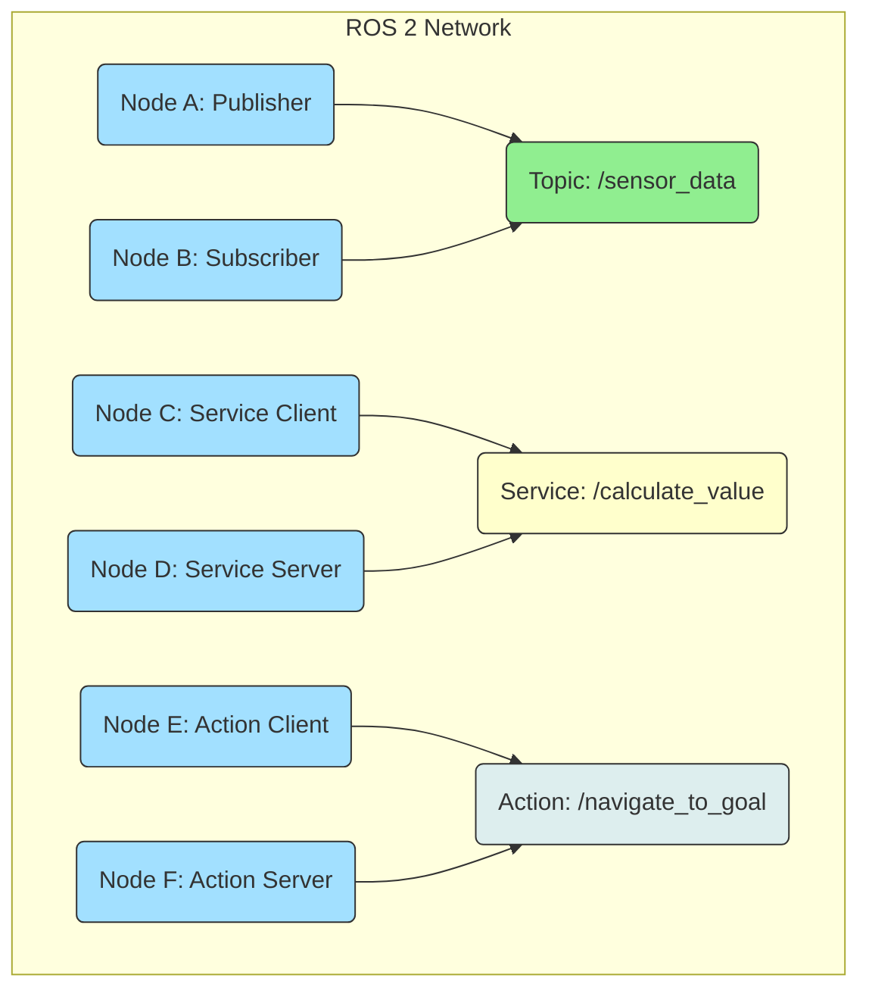

# 2. ROS 2 Nodes, Topics, and Services

## Explanation: Fundamental Communication Patterns in ROS 2

ROS 2's power as a robotics middleware stems from its modular architecture, built upon a few fundamental communication primitives. These primitives — **Nodes**, **Topics**, **Services**, and **Actions** (though Actions are conceptually built upon others, we'll focus on the core three here) — provide standardized, decoupled ways for different software components to interact. Understanding these patterns is key to designing any ROS 2 application, particularly for complex systems like humanoid robots.

### Nodes: The Computational Units

A **Node** is the smallest executable unit in a ROS 2 graph. Each node is an independent process designed to perform a specific, well-defined task. The philosophy behind nodes is modularity: instead of a single, monolithic program controlling the entire robot, functionality is broken down into smaller, interconnected components. This approach offers significant advantages:

*   **Modularity**: Encapsulates specific functionalities, making code easier to understand, develop, and maintain.
*   **Reusability**: Nodes can be reused across different projects or robots.
*   **Fault Isolation**: A crash in one node typically does not bring down the entire robot system.
*   **Distribution**: Nodes can run on different processors, different computers, or even across different geographical locations, communicating over a network.

For a humanoid robot, you might have nodes for:
*   `camera_driver_node`: Publishes image data.
*   `imu_fusion_node`: Processes IMU data for orientation.
*   `gait_planner_node`: Generates footstep plans.
*   `joint_controller_node`: Sends commands to motor drivers.
*   `speech_recognition_node`: Transcribes audio commands.

### Topics: Asynchronous Data Streams (Publisher/Subscriber Patterns)

**Topics** are the primary mechanism for asynchronous, one-way streaming of data in ROS 2. They implement a **publish-subscribe messaging pattern**.

*   A **Publisher Node** sends messages to a named topic.
*   Any number of **Subscriber Nodes** can "listen" to that topic and receive all messages published to it.

The key characteristics of topics are:
*   **Decoupling**: Publishers and subscribers do not need to know about each other's existence. They only need to agree on the topic name and the message type. This makes the system flexible and scalable.
*   **Asynchronous**: Publishers send messages without waiting for a response from subscribers. Subscribers process messages when they arrive.
*   **Many-to-Many Communication**: Multiple publishers can publish to the same topic, and multiple subscribers can listen to the same topic.
*   **Message Types**: Each topic is associated with a specific message type (e.g., `sensor_msgs/Image`, `geometry_msgs/Twist`, `std_msgs/String`). These message types define the structure and data fields of the information being exchanged.

**Real Example for Humanoid Robots**:
*   A `head_camera_node` publishes `sensor_msgs/Image` messages to `/humanoid/camera/image_raw`.
*   A `face_detection_node` subscribes to `/humanoid/camera/image_raw` to detect faces.
*   A `teleop_node` publishes `geometry_msgs/Twist` messages to `/humanoid/cmd_vel` to control the robot's base movement.
*   A `whole_body_controller_node` subscribes to `/humanoid/cmd_vel` and publishes `sensor_msgs/JointState` to `/humanoid/joint_states`.

### Services: Synchronous Request/Reply Interactions

**Services** provide a synchronous, request-reply communication pattern, akin to a remote procedure call (RPC). This is used when a node needs to send a request to another node and wait for an immediate response.

*   A **Service Server Node** offers a specific service (e.g., `compute_inverse_kinematics`).
*   A **Service Client Node** sends a request message to the service server and blocks, waiting for a response.

Key characteristics of services:
*   **Synchronous**: The client waits for the response from the server.
*   **One-to-One Communication**: A client sends a request to a single server and expects a response from that server.
*   **Request/Response Types**: Each service defines a request message type and a response message type.

**Real Example for Humanoid Robots**:
*   A `motion_planner_node` needs to calculate joint angles for a desired end-effector pose. It acts as a client, calling an `inverse_kinematics_server` service (e.g., `kinematics_msgs/GetKinematicSolverInfo`). The client sends the desired pose as a request and waits for the joint angles as a response.
*   A `gait_planner_node` might call a `footstep_generation_server` to get a sequence of feasible footsteps for a given target.

### Actions: Goal-Oriented, Long-Running Tasks

While not one of the "core three" in the same sense as nodes, topics, and services are fundamental building blocks, **Actions** are a higher-level abstraction in ROS 2 that are built upon topics and services. They are designed for long-running, goal-oriented tasks that may require preemption (cancellation) and provide continuous feedback.

*   An **Action Client** sends a goal to an **Action Server**.
*   The Action Server accepts the goal, processes it, provides continuous **feedback** to the client, and eventually returns a **result**.
*   The client can also **cancel** an ongoing goal.

**Real Example for Humanoid Robots**:
*   A `high_level_task_node` acts as an action client, sending a goal to a `navigation_action_server` to "navigate to the kitchen."
*   The `navigation_action_server` provides feedback on the robot's current position and progress towards the kitchen.
*   The `high_level_task_node` can cancel the navigation if a more urgent task arises.
*   The `navigation_action_server` returns `success` or `failure` and the final pose as a result.

## Code Examples

### Python Example: Publisher, Subscriber, Service Server, and Service Client (using `rclpy`)

Here's a comprehensive example demonstrating all three core communication patterns in Python.

**1. Publisher Node (`simple_publisher.py`)**


```python
import rclpy
from rclpy.node import Node
from std_msgs.msg import String # Standard string message type

class SimplePublisher(Node):
    def __init__(self):
        super().__init__('simple_publisher') # Node name
        self.publisher_ = self.create_publisher(String, 'my_topic', 10) # Topic name, QoS depth
        timer_period = 1.0  # seconds
        self.timer = self.create_timer(timer_period, self.timer_callback)
        self.i = 0

    def timer_callback(self):
        msg = String()
        msg.data = f'Hello from ROS 2! Count: {self.i}'
        self.publisher_.publish(msg)
        self.get_logger().info(f'Publishing: "{msg.data}"')
        self.i += 1

def main(args=None):
    rclpy.init(args=args)
    node = SimplePublisher()
    try:
        rclpy.spin(node)
    except KeyboardInterrupt:
        node.get_logger().info('Publisher stopped cleanly')
    finally:
        node.destroy_node()
        rclpy.shutdown()

if __name__ == '__main__':
    main()
```


**2. Subscriber Node (`simple_subscriber.py`)**


```python
import rclpy
from rclpy.node import Node
from std_msgs.msg import String # Standard string message type

class SimpleSubscriber(Node):
    def __init__(self):
        super().__init__('simple_subscriber') # Node name
        self.subscription = self.create_subscription(
            String,
            'my_topic', # Topic name to subscribe to
            self.listener_callback,
            10) # QoS depth
        self.get_logger().info('Subscriber started, listening to "my_topic".')

    def listener_callback(self, msg):
        self.get_logger().info(f'I heard: "{msg.data}"')

def main(args=None):
    rclpy.init(args=args)
    node = SimpleSubscriber()
    try:
        rclpy.spin(node)
    except KeyboardInterrupt:
        node.get_logger().info('Subscriber stopped cleanly')
    finally:
        node.destroy_node()
        rclpy.shutdown()

if __name__ == '__main__':
    main()
```


**3. Service Server Node (`simple_service_server.py`)**

First, define a custom service message. Create `my_package/srv/AddTwoInts.srv`:
```
int64 a
int64 b
---
int64 sum
```
Then, the server code:


```python
import rclpy
from rclpy.node import Node
from my_package_py.srv import AddTwoInts # Import custom service type

class SimpleServiceServer(Node):
    def __init__(self):
        super().__init__('simple_service_server')
        self.srv = self.create_service(AddTwoInts, 'add_two_ints', self.add_two_ints_callback)
        self.get_logger().info('Service server "add_two_ints" ready.')

    def add_two_ints_callback(self, request, response):
        response.sum = request.a + request.b
        self.get_logger().info(f'Incoming request: a={request.a}, b={request.b}. Sending response: sum={response.sum}')
        return response

def main(args=None):
    rclpy.init(args=args)
    node = SimpleServiceServer()
    try:
        rclpy.spin(node)
    except KeyboardInterrupt:
        node.get_logger().info('Service server stopped cleanly')
    finally:
        node.destroy_node()
        rclpy.shutdown()

if __name__ == '__main__':
    main()
```


**4. Service Client Node (`simple_service_client.py`)**


```python
import rclpy
from rclpy.node import Node
from my_package_py.srv import AddTwoInts # Import custom service type
import sys

class SimpleServiceClient(Node):
    def __init__(self):
        super().__init__('simple_service_client')
        self.client = self.create_client(AddTwoInts, 'add_two_ints')
        while not self.client.wait_for_service(timeout_sec=1.0):
            self.get_logger().info('Service not available, waiting...')
        self.get_logger().info('Service client ready.')

    def send_request(self, a, b):
        request = AddTwoInts.Request()
        request.a = a
        request.b = b
        self.future = self.client.call_async(request)
        self.get_logger().info(f'Sent request: a={a}, b={b}')


def main(args=None):
    rclpy.init(args=args)
    node = SimpleServiceClient()

    if len(sys.argv) != 3:
        node.get_logger().error('Usage: ros2 run my_package_py simple_service_client A B')
        rclpy.shutdown()
        sys.exit(1)

    a = int(sys.argv[1])
    b = int(sys.argv[2])
    node.send_request(a, b)

    while rclpy.ok():
        rclpy.spin_once(node)
        if node.future.done():
            try:
                response = node.future.result()
            except Exception as e:
                node.get_logger().error(f'Service call failed: {e}')
            else:
                node.get_logger().info(f'Result of add_two_ints: {response.sum}')
            break

    node.destroy_node()
    rclpy.shutdown()

if __name__ == '__main__':
    main()
```

To run these examples, you would typically place them within a ROS 2 Python package (e.g., `my_package_py`), define the `AddTwoInts.srv` file, and ensure your `setup.py` and `package.xml` are correctly configured for ROS 2 build.

## Diagrams (in Markdown)

### ROS 2 Communication Patterns


*Figure 1.2: ROS 2 Communication Patterns. This diagram illustrates how nodes use topics for asynchronous publish-subscribe messaging, services for synchronous request-reply interactions, and actions for goal-oriented, long-running tasks within the ROS 2 ecosystem.*

## Tables

| Communication Primitive | Type             | Direction     | Use Case                                                    | Key Characteristic                                    | Humanoid Example                                            |
|-------------------------|------------------|---------------|-------------------------------------------------------------|-------------------------------------------------------|-------------------------------------------------------------|
| **Node**                | Executable Unit  | N/A           | Encapsulates a specific computation.                        | Modular, independent process.                         | `gait_planner_node`, `head_controller_node`.                |
| **Topic**               | Publish/Subscribe| One-way (async) | Continuous data streams (sensor readings, joint states).      | Decoupled, many-to-many communication.                | Publishing `/imu/data`, subscribing to `/joint_states`.     |
| **Service**             | Request/Reply    | Two-way (sync)  | Requesting a one-time computation or specific data.           | Synchronous, client waits for response.               | Requesting `solve_ik` (Inverse Kinematics) or `get_map`.    |
| **Action**              | Goal-oriented    | Two-way (async) | Long-duration tasks with feedback and preemption.             | Asynchronous, provides feedback, cancellable goals.   | `navigate_to_pose`, `perform_manipulation_sequence`.        |

## Callouts

:::tip
**Use `ros2 topic list -t`**: When debugging communication issues, `ros2 topic list -t` shows not only topic names but also their message types, which is crucial for ensuring publishers and subscribers are compatible.
:::

:::warning
**Service Timeout Considerations**: When using services, clients block until a response is received. In real-time critical systems, implement timeouts (`rclpy.client.Client.wait_for_service(timeout_sec)`) to prevent indefinite blocking and ensure system responsiveness.
:::

## Real Examples for Humanoid Robots

1.  **Whole-Body Control (Topics)**: A `whole_body_controller_node` subscribes to `/joint_states` (publishing current joint positions/velocities from encoders) and publishes `/joint_group_commands` (desired joint efforts/positions) to `ros2_control` hardware interfaces. This high-frequency data exchange is handled efficiently via topics.
2.  **Inverse Kinematics (Services)**: Before executing a grasp, a `manipulation_planner_node` acts as a client to a `kinematics_service_server`. It sends the desired end-effector pose (position and orientation) as a service request. The server computes the corresponding joint angles required to reach that pose and returns them as a service response.
3.  **Autonomous Navigation (Actions)**: A `high_level_task_manager_node` commands the humanoid to move from its current location to a specific room. It sends a goal to the `navigation_action_server`. As the humanoid walks, the `navigation_action_server` provides continuous feedback on its progress (e.g., "robot is 5m from destination," "path blocked, re-planning"). If an emergency occurs, the task manager can preempt (cancel) the navigation goal.

## Summary

This chapter has provided a deep dive into the fundamental communication patterns that underpin ROS 2: Nodes, Topics, Services, and Actions. Nodes serve as the modular computational units, while Topics enable asynchronous, decoupled data streaming essential for continuous sensor and control data. Services facilitate synchronous request-reply interactions for discrete tasks, and Actions provide a robust framework for managing long-running, goal-oriented operations with feedback and preemption. These primitives, backed by the DDS middleware, are critical for managing the complexity, real-time demands, and distributed nature of humanoid robotics, allowing for efficient data exchange and coordination among the robot's many subsystems.

## Exercises

1.  **Choose the Right Primitive**: For each of the following scenarios involving a humanoid robot, identify whether a ROS 2 Topic, Service, or Action would be most appropriate, and explain why:
    *   Continuously publishing the battery level of the robot.
    *   Requesting the robot to identify all objects currently visible in its camera feed (a single query).
    *   Commanding the robot to perform a complex dance routine.
    *   Sending an emergency stop signal to all joint controllers.
2.  **Service Design**: Design a ROS 2 service message (`.srv` file) for a humanoid robot that takes a target `x, y, z` coordinate and an `orientation` (quaternion) for its head and returns a boolean indicating if the head can reach that pose, along with the joint angles if possible.
3.  **Topic Message Content**: A `footstep_planner_node` needs to publish the upcoming footstep locations for a humanoid. Describe the key data fields you would expect in a custom ROS 2 message type for this purpose. Consider position, orientation, and which leg.
4.  **Action Feedback**: For the "perform a complex dance routine" action, what kind of feedback (`feedback` field in Action message) would be useful for a client node to receive, and what would be the final `result`?
5.  **DDS QoS Application**: A humanoid robot's `joint_state_publisher` node (publishing `sensor_msgs/JointState`) needs to update a `whole_body_controller_node` at 100 Hz. The data is critical. What DDS QoS policy (Reliability, Durability, History) settings would you recommend and why?

